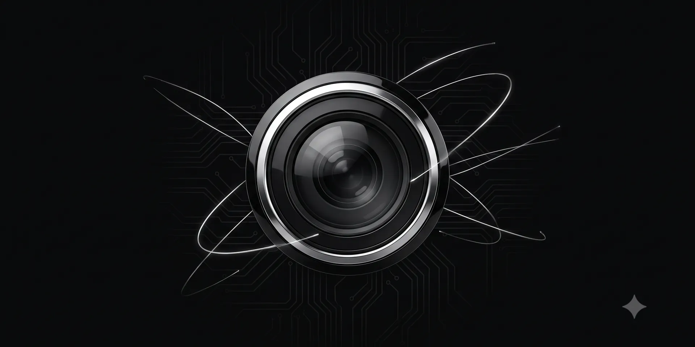

# Camio Desktop

This is the desktop installer for [Camio](https://github.com/simplysandeepp/camio), a private, self-hosted security camera web application. 

This repository (`camio-desktop`) provides an Electron wrapper that allows you to easily install and run Camio as a native desktop application, instead of needing to run it through terminal commands. 

## 📥 Download

👉 **[Download the latest installer (Linux & macOS)](https://github.com/simplysandeepp/camio/releases/tag/v0.2.0)**

*Note: For Windows, this is currently not supported. macOS releases are unnotarized (you will need to right-click and "Open"). Linux users can download either the portable `.AppImage` or the installable `.deb` file.*

For all details regarding how Camio works under the hood, how the camera pipeline operates, and security features, please refer to the [primary Camio repository](https://github.com/simplysandeepp/camio).
